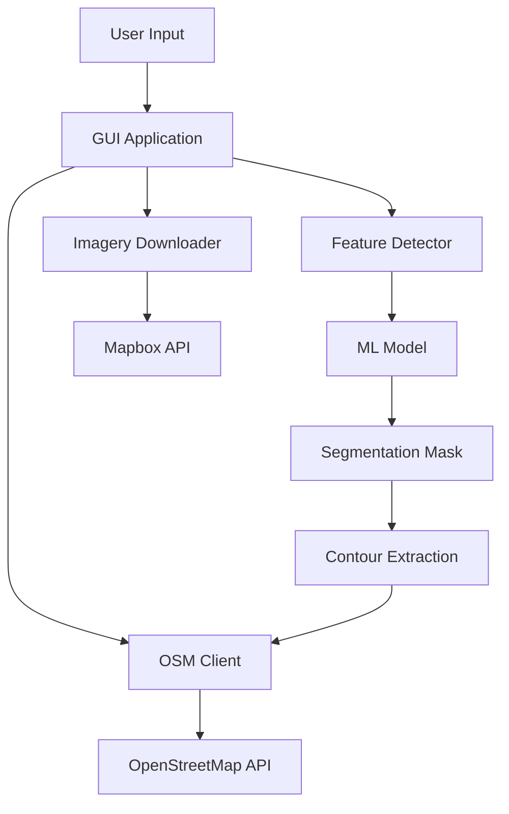

# Code Review: osmiD-AI-editor

**Review Date:** 2025-11-16
**Reviewer:** Claude Code
**Commit:** f2c51e2
**Lines of Code:** ~2,660 Python LOC

---

## Executive Summary

The osmiD-AI-editor is an ambitious ML-powered system for automated OpenStreetMap feature detection and mapping. While the project shows good structural organization and modern ML practices, it has **critical security vulnerabilities** and lacks essential safeguards for an automated OSM editing tool.

### Risk Level: 🔴 **HIGH**

**Critical Issues:** 8 security vulnerabilities, no testing infrastructure
**Major Issues:** Automated OSM uploads without adequate validation, poor error handling
**Minor Issues:** Code quality, documentation gaps

**Recommendation:** **DO NOT deploy to production** until critical security issues are resolved and comprehensive testing is implemented.

---

## 1. Critical Security Issues 🔴

### 1.1 Plaintext Password Handling
**Severity:** CRITICAL
**Files:** `part3_executable/gui_application.py`, `part3_executable/osm_client.py`

**Issue:**
```python
# gui_application.py:214
self.password_input = QLineEdit()
self.password_input.setEchoMode(QLineEdit.Password)  # Only hides display

# gui_application.py:295
password = self.password_input.text()  # Plaintext password

# osm_client.py:40
self.password = password  # Stored as class attribute
```

**Problems:**
- Passwords stored in plaintext in memory
- No encryption or secure storage
- Password remains in memory after use
- Could be extracted from memory dumps

**Recommendation:**
```python
# Use secure string handling
from getpass import getpass
import hashlib

# Clear password from memory after use
def authenticate(self, email: str, password: str) -> bool:
    try:
        # Use password, then clear
        result = self._do_auth(email, password)
    finally:
        # Overwrite password in memory
        password = None
        del password
    return result
```

### 1.2 API Token Exposure in URLs
**Severity:** CRITICAL
**Files:** `part1_data_acquisition/mapbox_imagery.py:87`, `part3_executable/gui_application.py:90`

**Issue:**
```python
# mapbox_imagery.py:87
url = (
    f"{self.base_url}/"
    f"{center_lon},{center_lat},{zoom}/"
    f"{width}x{height}"
    f"?access_token={self.access_token}"  # ❌ Token in query string
)
```

**Problems:**
- Tokens logged in proxy logs, browser history, server logs
- Potential token leakage through referrer headers
- Violates security best practices

**Recommendation:**
```python
# Use Authorization header instead
headers = {
    'Authorization': f'Bearer {self.access_token}'
}
response = requests.get(url, headers=headers, timeout=60)
```

### 1.3 Missing Input Validation
**Severity:** HIGH
**Files:** `part3_executable/gui_application.py:46-76`

**Issue:**
```python
# gui_application.py:59-60
pattern = r'\{([0-9.-]+),([0-9.-]+)\}'
matches = re.findall(pattern, polygon_str)
coords = [(float(lat), float(lon)) for lat, lon in matches]
# ❌ No validation of coordinate bounds
```

**Problems:**
- Accepts invalid coordinates (e.g., lat=999, lon=-999)
- No validation of polygon validity (self-intersecting, etc.)
- Could cause crashes or undefined behavior

**Recommendation:**
```python
def validate_coordinates(lat: float, lon: float) -> bool:
    """Validate lat/lon bounds"""
    if not (-90 <= lat <= 90):
        raise ValueError(f"Invalid latitude: {lat} (must be -90 to 90)")
    if not (-180 <= lon <= 180):
        raise ValueError(f"Invalid longitude: {lon} (must be -180 to 180)")
    return True

coords = [(float(lat), float(lon)) for lat, lon in matches]
for lat, lon in coords:
    validate_coordinates(lat, lon)
```

### 1.4 Path Traversal Vulnerability
**Severity:** HIGH
**Files:** `part3_executable/gui_application.py:312`, `part3_executable/feature_detector.py:46`

**Issue:**
```python
# gui_application.py:312
model_path = self.model_input.text().strip()
if not model_path or not os.path.exists(model_path):
    # ❌ No validation of path safety

# feature_detector.py:46
checkpoint = torch.load(model_path, map_location=self.device)
# ❌ Could load arbitrary pickle files
```

**Problems:**
- User can specify arbitrary file paths
- `torch.load()` uses pickle (arbitrary code execution risk)
- No whitelist of allowed paths

**Recommendation:**
```python
import os.path

ALLOWED_MODEL_DIR = os.path.abspath('./models/checkpoints')

def validate_model_path(path: str) -> str:
    """Validate model path is within allowed directory"""
    abs_path = os.path.abspath(path)
    if not abs_path.startswith(ALLOWED_MODEL_DIR):
        raise ValueError("Model path must be in ./models/checkpoints/")
    if not path.endswith('.pth'):
        raise ValueError("Model must be a .pth file")
    return abs_path

# Use weights_only for PyTorch >= 2.0
checkpoint = torch.load(model_path, map_location=self.device, weights_only=True)
```

### 1.5 No HTTPS Certificate Verification
**Severity:** MEDIUM
**Files:** Multiple files using `requests.get()`

**Issue:**
```python
# mapbox_imagery.py:93
response = requests.get(url, timeout=60)
# ❌ No explicit verify=True (uses default, but not explicit)
```

**Recommendation:**
```python
# Explicitly verify SSL certificates
response = requests.get(url, timeout=60, verify=True)

# Or use requests Session with configured SSL
session = requests.Session()
session.verify = True
response = session.get(url, timeout=60)
```

### 1.6 SQL Injection Risk (Future)
**Severity:** MEDIUM (Preventive)
**Note:** No SQL currently, but if database added

**Recommendation:**
```python
# When adding database persistence, use parameterized queries
# ❌ DON'T DO THIS:
# cursor.execute(f"INSERT INTO features VALUES ('{feature_id}')")

# ✅ DO THIS:
cursor.execute("INSERT INTO features VALUES (?)", (feature_id,))
```

### 1.7 Unsafe Deserialization
**Severity:** HIGH
**Files:** `part3_executable/feature_detector.py:46`

**Issue:**
```python
# PyTorch uses pickle for model loading - arbitrary code execution risk
checkpoint = torch.load(model_path, map_location=self.device)
```

**Recommendation:**
```python
# Use weights_only=True for PyTorch 2.0+
checkpoint = torch.load(
    model_path,
    map_location=self.device,
    weights_only=True  # Prevents arbitrary code execution
)
```

### 1.8 No Rate Limiting Protection
**Severity:** MEDIUM
**Files:** `part3_executable/osm_client.py:136`, `part1_data_acquisition/osm_downloader.py:190`

**Issue:**
```python
# osm_client.py:136
time.sleep(0.1)  # Basic rate limiting
# osm_client.py:239
time.sleep(0.5)  # Inconsistent delays
```

**Problems:**
- No exponential backoff on failures
- Fixed delays don't account for API rate limits
- Could trigger IP bans

**Recommendation:**
```python
import time
from functools import wraps

def retry_with_backoff(max_retries=3, base_delay=1):
    """Decorator for exponential backoff retry"""
    def decorator(func):
        @wraps(func)
        def wrapper(*args, **kwargs):
            for attempt in range(max_retries):
                try:
                    return func(*args, **kwargs)
                except requests.exceptions.RequestException as e:
                    if attempt == max_retries - 1:
                        raise
                    delay = base_delay * (2 ** attempt)
                    print(f"Retry {attempt + 1}/{max_retries} after {delay}s...")
                    time.sleep(delay)
        return wrapper
    return decorator

@retry_with_backoff(max_retries=4, base_delay=2)
def create_node(self, lat, lon):
    # Implementation
    pass
```

---

## 2. Critical Design Issues 🟠

### 2.1 No Testing Infrastructure
**Severity:** CRITICAL
**Files:** None (tests missing)

**Issue:**
- No unit tests for any component
- No integration tests
- No test for coordinate conversion (critical for correctness)
- No mock tests for API interactions
- Automated OSM edits without testing is **extremely risky**

**Impact:**
- Cannot verify correctness
- Coordinate bugs could map features to wrong locations
- Could corrupt OpenStreetMap data

**Recommendation:**
```bash
# Add testing structure
mkdir tests/
touch tests/__init__.py
touch tests/test_coordinate_conversion.py
touch tests/test_feature_detection.py
touch tests/test_osm_client.py
```

```python
# tests/test_coordinate_conversion.py
import pytest
import numpy as np
from part3_executable.feature_detector import FeatureDetector

def test_pixel_to_latlon_center():
    """Test pixel to lat/lon conversion for center point"""
    detector = FeatureDetector.__new__(FeatureDetector)

    bbox = [48.8, 2.3, 48.9, 2.4]  # south, west, north, east
    img_width, img_height = 1000, 1000

    # Center pixel should map to center lat/lon
    pixel_coords = np.array([[500, 500]])
    result = detector.pixel_to_latlon(pixel_coords, bbox, img_width, img_height)

    expected_lat = (48.8 + 48.9) / 2  # 48.85
    expected_lon = (2.3 + 2.4) / 2    # 2.35

    assert abs(result[0][0] - expected_lat) < 0.001
    assert abs(result[0][1] - expected_lon) < 0.001

def test_coordinate_order():
    """Verify (lat, lon) order is consistent"""
    # Critical test - wrong order maps features to wrong location!
    pass
```

### 2.2 Automated OSM Uploads Without Validation
**Severity:** CRITICAL
**Files:** `part3_executable/osm_client.py:203-251`

**Issue:**
```python
# osm_client.py:227
for i, feature in enumerate(features):
    # ❌ No verification of detected features
    # ❌ No user review before upload
    # ❌ No dry-run mode
    way_id = self.create_building(feature['coordinates'])
```

**Problems:**
- Violates OSM Automated Edits Code of Conduct
- No human review of AI detections
- Could mass-upload incorrect features
- No rollback capability
- Could damage OSM database reputation

**Recommendation:**
```python
class OSMClient:
    def __init__(self, dry_run: bool = True):  # Default to dry run
        self.dry_run = dry_run

    def upload_features(self, features, changeset_comment, require_review=True):
        """Upload features with safety checks"""

        # Generate preview
        preview = self._generate_preview(features)

        if require_review:
            print("\n=== FEATURE REVIEW ===")
            print(preview)
            confirmation = input("Upload these features to OSM? (yes/no): ")
            if confirmation.lower() != 'yes':
                print("Upload cancelled")
                return []

        if self.dry_run:
            print("DRY RUN MODE - No actual upload")
            return [f"dry_run_{i}" for i in range(len(features))]

        # Actual upload with audit trail
        return self._do_upload(features, changeset_comment)

    def _generate_preview(self, features):
        """Generate human-readable preview of features"""
        summary = f"Total features: {len(features)}\n"
        by_type = {}
        for f in features:
            by_type[f['type']] = by_type.get(f['type'], 0) + 1
        for ftype, count in by_type.items():
            summary += f"  {ftype}: {count}\n"
        return summary
```

### 2.3 No Logging Framework
**Severity:** HIGH
**Files:** All files use `print()` statements

**Issue:**
```python
# Multiple files
print(f"✓ Downloaded imagery")  # ❌ Should use logging
print(f"✗ Error: {str(e)}")     # ❌ No log levels
```

**Problems:**
- No log levels (DEBUG, INFO, WARNING, ERROR)
- Cannot filter logs
- No structured logging
- No log rotation or persistence
- Difficult to debug production issues

**Recommendation:**
```python
# common/logging_config.py
import logging
import sys
from pathlib import Path

def setup_logging(log_level=logging.INFO):
    """Configure application logging"""

    # Create logs directory
    Path('./logs').mkdir(exist_ok=True)

    # Configure root logger
    logging.basicConfig(
        level=log_level,
        format='%(asctime)s - %(name)s - %(levelname)s - %(message)s',
        handlers=[
            logging.FileHandler('./logs/osmid.log'),
            logging.StreamHandler(sys.stdout)
        ]
    )

    return logging.getLogger('osmid')

# Usage in files:
# from common.logging_config import setup_logging
# logger = setup_logging()
# logger.info("Downloaded imagery")
# logger.error("Error: %s", str(e))
```

---

## 3. Code Quality Issues 🟡

### 3.1 Overly Broad Exception Handling
**Severity:** MEDIUM
**Files:** Multiple files

**Issue:**
```python
# osm_downloader.py:114
try:
    result = self.api.query(query)
    # ... processing
except Exception as e:  # ❌ Too broad
    print(f"✗ Error downloading data: {str(e)}")
    raise
```

**Problems:**
- Catches all exceptions including KeyboardInterrupt, SystemExit
- Hides specific errors
- Makes debugging difficult

**Recommendation:**
```python
# Be specific about exceptions
try:
    result = self.api.query(query)
    geojson = self._convert_to_geojson(result, city, features)
except overpy.exception.OverpassTooManyRequests:
    logger.error("Rate limit exceeded, waiting...")
    time.sleep(60)
    raise
except overpy.exception.OverpassGatewayTimeout:
    logger.error("Gateway timeout, retrying...")
    raise
except (ValueError, KeyError) as e:
    logger.error("Data parsing error: %s", e)
    raise
except Exception as e:
    logger.exception("Unexpected error downloading data")
    raise
```

### 3.2 Code Duplication
**Severity:** MEDIUM
**Files:** Multiple files

**Issue:**
```python
# CITIES dictionary duplicated in 3 files:
# - part1_data_acquisition/osm_downloader.py:18
# - part1_data_acquisition/mapbox_imagery.py:183
# - part1_data_acquisition/feature_correlator.py:245
```

**Recommendation:**
```python
# common/constants.py
CITIES = {
    'paris': [48.815573, 2.224199, 48.902145, 2.469920],
    'london': [51.286760, -0.510375, 51.691874, 0.334015],
    # ... other cities
}

FEATURE_CLASSES = {
    0: 'background',
    1: 'building',
    2: 'lawn',
    3: 'natural_wood',
    4: 'artificial_forest',
    5: 'water_body'
}

# Import in other files:
# from common.constants import CITIES, FEATURE_CLASSES
```

### 3.3 Hard-coded Magic Numbers
**Severity:** LOW
**Files:** Multiple files

**Issue:**
```python
# feature_detector.py:156
pixel_distance = max(1, int(point_distance / 0.6))  # ❌ Magic number

# dataset.py:156
# Assuming ~0.6m per pixel at zoom 17  # ❌ Hard-coded assumption
```

**Recommendation:**
```python
# common/constants.py
ZOOM_LEVEL_RESOLUTIONS = {
    16: 1.2,   # meters per pixel
    17: 0.6,
    18: 0.3,
    19: 0.15
}

DEFAULT_ZOOM = 17
CONTOUR_POINT_DISTANCE_METERS = 3.0

# Usage:
resolution = ZOOM_LEVEL_RESOLUTIONS[zoom_level]
pixel_distance = max(1, int(CONTOUR_POINT_DISTANCE_METERS / resolution))
```

### 3.4 Missing Type Hints
**Severity:** LOW
**Files:** Some functions missing complete type hints

**Issue:**
```python
# osm_client.py:67
def create_changeset(self, comment: str = "Automated feature mapping"):
    # ❌ Missing return type hint
```

**Recommendation:**
```python
def create_changeset(self, comment: str = "Automated feature mapping") -> int:
    """Create a new changeset

    Returns:
        int: Changeset ID
    """
```

### 3.5 Inconsistent Error Handling Strategy
**Severity:** MEDIUM
**Files:** Multiple files

**Issue:**
```python
# Some functions raise exceptions:
# osm_downloader.py:88
if city not in self.CITIES:
    raise ValueError(f"City {city} not in available cities")

# Others print and continue:
# osm_downloader.py:192
except Exception as e:
    print(f"Failed to download {city}: {str(e)}")
    continue  # ❌ Inconsistent
```

**Recommendation:**
Decide on a consistent strategy:
- **Raise exceptions** for exceptional conditions
- **Log and return** for expected failures
- **Never silently continue** without logging

---

## 4. Dependency Issues 📦

### 4.1 TensorFlow Not Used
**Severity:** LOW
**Files:** `requirements.txt:12`

**Issue:**
```text
# requirements.txt:12
tensorflow>=2.13.0  # ❌ Not used anywhere in code
```

Code only uses PyTorch. TensorFlow adds ~500MB to installation.

**Recommendation:**
```bash
# Remove from requirements.txt
# tensorflow>=2.13.0
```

### 4.2 Unpinned Dependencies
**Severity:** MEDIUM
**Files:** `requirements.txt`

**Issue:**
```text
# requirements.txt uses >= instead of ==
requests>=2.31.0  # ❌ Could install incompatible future version
torch>=2.0.0      # ❌ Breaking changes possible
```

**Recommendation:**
```bash
# Pin exact versions for reproducibility
pip freeze > requirements-locked.txt

# Or use poetry/pipenv for dependency management
poetry add torch==2.0.1
```

### 4.3 No Dependency Vulnerability Scanning
**Severity:** MEDIUM

**Recommendation:**
```bash
# Add to CI/CD pipeline
pip install safety
safety check --file requirements.txt

# Or use dependabot (GitHub)
# Create .github/dependabot.yml
```

---

## 5. Architecture Issues 🏗️

### 5.1 Tight Coupling
**Severity:** MEDIUM
**Files:** `part3_executable/gui_application.py:341`

**Issue:**
```python
# gui_application.py:341
self.worker = MappingWorker(email, password, polygon, model_path, mapbox_token)
# ❌ GUI tightly coupled to worker implementation
```

**Recommendation:**
```python
# Use dependency injection
class MappingWorker(QThread):
    def __init__(
        self,
        detector_factory,  # Factory function
        osm_client_factory,
        imagery_downloader_factory,
        **params
    ):
        self.detector = detector_factory(**params)
        # ...

# Easier to test and mock
```

### 5.2 No Configuration Management
**Severity:** MEDIUM

**Issue:**
- Config scattered across:
  - `.env.example`
  - `config.yaml`
  - Hard-coded values in `__main__` blocks

**Recommendation:**
```python
# common/config.py
from dataclasses import dataclass
from typing import List
import yaml
import os
from dotenv import load_dotenv

@dataclass
class Config:
    """Application configuration"""
    # API
    mapbox_token: str
    osm_api_url: str

    # Paths
    data_dir: str
    model_dir: str
    log_dir: str

    # Training
    batch_size: int
    epochs: int
    learning_rate: float

    # Cities
    train_cities: List[str]
    val_cities: List[str]

    @classmethod
    def load(cls, config_path: str = 'config.yaml'):
        """Load configuration from file and environment"""
        load_dotenv()

        with open(config_path) as f:
            config_data = yaml.safe_load(f)

        # Override with environment variables
        config_data['mapbox_token'] = os.getenv('MAPBOX_ACCESS_TOKEN')

        return cls(**config_data)

# Usage:
# config = Config.load()
# print(config.batch_size)
```

### 5.3 No Abstraction for External Services
**Severity:** LOW

**Recommendation:**
```python
# Create abstract interfaces for external services
from abc import ABC, abstractmethod

class ImageryProvider(ABC):
    """Abstract interface for satellite imagery providers"""

    @abstractmethod
    def download_imagery(self, bbox, zoom):
        pass

class MapboxImageryProvider(ImageryProvider):
    def download_imagery(self, bbox, zoom):
        # Mapbox implementation
        pass

class SentinelImageryProvider(ImageryProvider):
    def download_imagery(self, bbox, zoom):
        # Sentinel-2 implementation
        pass

# Easy to swap providers
```

---

## 6. Potential Bugs 🐛

### 6.1 Coordinate Order Confusion
**Severity:** HIGH
**Files:** Multiple files

**Issue:**
Inconsistent use of (lat, lon) vs (lon, lat):
- GeoJSON uses [lon, lat] order
- OSM API uses (lat, lon) order
- Code mixes both without clear documentation

**Critical Examples:**
```python
# osm_downloader.py:141 - GeoJSON format [lon, lat]
coords = [[float(node.lon), float(node.lat)] for node in way.nodes]

# osm_client.py:129 - OSM API format (lat, lon)
node = self.api.NodeCreate({
    "lat": lat,
    "lon": lon,
    "tag": {}
})

# feature_correlator.py:128 - Mixed usage
# for lon, lat in exterior_coords:  # Input is [lon, lat]
#     self.latlon_to_pixel(lat, lon, ...)  # But called with (lat, lon)
```

**Impact:** **CRITICAL** - Could map features to completely wrong locations!

**Recommendation:**
```python
# Create explicit coordinate types
from typing import NamedTuple

class LatLon(NamedTuple):
    """Latitude/Longitude pair (OSM/API standard)"""
    lat: float
    lon: float

    def to_geojson(self) -> List[float]:
        """Convert to GeoJSON [lon, lat] format"""
        return [self.lon, self.lat]

class LonLat(NamedTuple):
    """Longitude/Latitude pair (GeoJSON standard)"""
    lon: float
    lat: float

    def to_latlon(self) -> LatLon:
        """Convert to LatLon"""
        return LatLon(lat=self.lat, lon=self.lon)

# Usage forces explicit conversion:
geojson_coord = LonLat(lon=2.3, lat=48.8)
osm_coord = geojson_coord.to_latlon()
api.create_node(osm_coord.lat, osm_coord.lon)
```

### 6.2 Missing Polygon Validation
**Severity:** MEDIUM
**Files:** `part3_executable/gui_application.py:46`

**Issue:**
```python
# No validation of polygon validity:
# - Self-intersecting polygons
# - Clockwise vs counter-clockwise winding
# - Minimum points
```

**Recommendation:**
```python
from shapely.geometry import Polygon
from shapely.validation import explain_validity

def validate_polygon(coords):
    """Validate polygon geometry"""
    if len(coords) < 3:
        raise ValueError("Polygon must have at least 3 points")

    poly = Polygon(coords)

    if not poly.is_valid:
        raise ValueError(f"Invalid polygon: {explain_validity(poly)}")

    if poly.area == 0:
        raise ValueError("Polygon has zero area")

    return poly
```

### 6.3 Race Condition in Changeset Management
**Severity:** MEDIUM
**Files:** `part3_executable/osm_client.py:94-102`

**Issue:**
```python
# osm_client.py:98
def close_changeset(self):
    if self.changeset_id:
        try:
            self.api.ChangesetClose()  # ❌ Could fail, leaving changeset open
            self.changeset_id = None
        except Exception as e:
            print(f"✗ Error closing changeset: {str(e)}")
            # ❌ changeset_id not cleared on error
```

**Recommendation:**
```python
def close_changeset(self):
    """Close the current changeset with proper error handling"""
    if not self.changeset_id:
        return

    changeset_id = self.changeset_id
    self.changeset_id = None  # Clear immediately

    try:
        self.api.ChangesetClose()
        logger.info(f"Closed changeset: {changeset_id}")
    except Exception as e:
        logger.error(f"Failed to close changeset {changeset_id}: {e}")
        # Changeset will auto-close after 1 hour
        raise
```

### 6.4 Memory Management Issues
**Severity:** MEDIUM
**Files:** Large image loading without cleanup

**Issue:**
```python
# Loading large images into memory without cleanup
img = Image.open(filepath)
img_array = np.array(img)  # Full image in memory
# ❌ No explicit cleanup
```

**Recommendation:**
```python
# Use context managers
from PIL import Image

with Image.open(filepath) as img:
    img_array = np.array(img)
    # Process image
# Image automatically closed

# Or explicit cleanup
import gc

def process_large_image(filepath):
    img = Image.open(filepath)
    try:
        result = process(np.array(img))
        return result
    finally:
        img.close()
        gc.collect()  # Force garbage collection
```

---

## 7. Documentation Issues 📚

### 7.1 Missing API Documentation
**Severity:** LOW

**Issue:**
- No API documentation generated
- Incomplete docstrings
- No examples in docstrings

**Recommendation:**
```bash
# Generate documentation with Sphinx
pip install sphinx sphinx-rtd-theme
sphinx-quickstart docs/
sphinx-apidoc -o docs/source/ .

# Or use mkdocs
pip install mkdocs mkdocs-material
mkdocs new .
mkdocs serve
```

### 7.2 No Architecture Diagram
**Severity:** LOW

**Recommendation:**
Add to README.md:
```markdown
## Architecture


```

### 7.3 Missing CONTRIBUTING.md
**Severity:** LOW

**Recommendation:**
Create CONTRIBUTING.md with:
- Code style guide
- Testing requirements
- PR process
- OSM community guidelines

---

## 8. Positive Aspects ✅

### 8.1 Well-Structured Project
- Clear separation into 3 logical parts
- Good module organization
- Sensible naming conventions

### 8.2 Modern ML Architecture
- U-Net is appropriate for semantic segmentation
- Multi-task learning (segmentation + contours) is a good approach
- Proper use of batch normalization and skip connections

### 8.3 Good Data Augmentation
```python
# dataset.py:225-234
train_transform = A.Compose([
    A.Resize(img_size[0], img_size[1]),
    A.HorizontalFlip(p=0.5),
    A.VerticalFlip(p=0.5),
    A.RandomRotate90(p=0.5),
    A.RandomBrightnessContrast(p=0.3),
    A.GaussNoise(p=0.2),
    # ...
])
```
Appropriate augmentations for satellite imagery.

### 8.4 OSM Community Awareness
- README mentions Automated Edits Code of Conduct
- Includes appropriate warnings
- Disclaimer about educational purposes

### 8.5 Comprehensive README
- Clear installation instructions
- Good usage examples
- Appropriate citations

---

## 9. Priority Recommendations

### Immediate (Before ANY Deployment) 🔴
1. **Fix credential handling** - Implement secure password storage
2. **Add input validation** - Validate all coordinates and file paths
3. **Add coordinate conversion tests** - Critical for correctness
4. **Implement dry-run mode** - Default to no-upload for testing
5. **Add comprehensive logging** - Replace all print() statements

### High Priority (Before Production) 🟠
6. **Add unit tests** - Minimum 70% coverage
7. **Add integration tests** - Test full pipeline
8. **Remove TensorFlow dependency**
9. **Pin dependencies** - Create requirements-locked.txt
10. **Fix coordinate order confusion** - Use typed coordinates
11. **Add rate limiting** - Exponential backoff
12. **Implement feature review UI** - Show detected features before upload

### Medium Priority (Quality Improvements) 🟡
13. **Refactor exception handling** - Use specific exceptions
14. **Remove code duplication** - Create common/constants.py
15. **Add configuration management** - Centralized Config class
16. **Add dependency injection** - Improve testability
17. **Generate API documentation** - Sphinx or mkdocs

### Low Priority (Nice to Have) 🟢
18. **Add architecture diagrams** - Visual documentation
19. **Create CONTRIBUTING.md** - Contributor guidelines
20. **Add abstraction layers** - ImageryProvider interface
21. **Implement feature rollback** - Track and revert uploads

---

## 10. Testing Recommendations

### Unit Tests (Required)
```bash
# Add pytest
pip install pytest pytest-cov pytest-mock

# Create test structure
tests/
├── __init__.py
├── conftest.py
├── test_coordinate_conversion.py
├── test_feature_detector.py
├── test_osm_client.py
├── test_data_acquisition.py
└── test_training.py
```

### Critical Tests Needed
1. **Coordinate Conversion Tests** (CRITICAL)
   - Test pixel_to_latlon() accuracy
   - Test latlon_to_pixel() inverse
   - Test coordinate order consistency
   - Test boundary conditions

2. **Feature Detection Tests**
   - Test contour extraction
   - Test contour simplification (3m spacing)
   - Test feature classification

3. **OSM Client Tests**
   - Mock API calls
   - Test authentication
   - Test changeset management
   - Test error handling

4. **Integration Tests**
   - End-to-end pipeline test
   - Test with sample data
   - Verify output correctness

---

## 11. Security Checklist

- [ ] Passwords encrypted/secured
- [ ] API tokens not in URLs
- [ ] Input validation on all user inputs
- [ ] Path traversal prevention
- [ ] HTTPS certificate verification
- [ ] Rate limiting implemented
- [ ] No SQL injection vulnerabilities
- [ ] Safe deserialization (weights_only=True)
- [ ] Dependency vulnerability scanning
- [ ] No secrets in repository
- [ ] Audit logging for all OSM uploads

---

## 12. OSM Community Compliance Checklist

- [ ] Dry-run mode implemented and default
- [ ] Human review before any upload
- [ ] Clear changeset comments with tool name and version
- [ ] Ability to rollback/delete uploaded features
- [ ] Documentation of mapping methodology
- [ ] Contact information in changesets
- [ ] Respect for local mapping community
- [ ] Testing in development environment first
- [ ] Monitoring for disputes and reverions
- [ ] Rate limiting to avoid server stress

---

## Conclusion

The osmiD-AI-editor shows promise as an ML-powered mapping tool, but **requires significant security and quality improvements before deployment**. The critical security vulnerabilities and lack of testing make it unsuitable for production use in its current state.

### Current State: 🔴 Not Production Ready

### Estimated Effort to Production:
- **Critical fixes:** 40-60 hours
- **Testing infrastructure:** 60-80 hours
- **Quality improvements:** 40-60 hours
- **Total:** ~140-200 hours (3-5 weeks full-time)

### Recommendation:
**Do not deploy to production until:**
1. All critical security issues resolved
2. Comprehensive test suite implemented (>70% coverage)
3. Dry-run mode tested extensively
4. Manual review of 100+ detected features for accuracy
5. OSM community consultation completed

---

## Appendix: File-by-File Summary

### Part 1: Data Acquisition
- `osm_downloader.py`: ⚠️ Needs better error handling, remove hard-coded CITIES
- `mapbox_imagery.py`: 🔴 API token in URL (critical), add retry logic
- `feature_correlator.py`: ⚠️ Coordinate order needs verification

### Part 2: Training
- `model.py`: ✅ Good architecture, well-structured
- `train.py`: ⚠️ Add validation metrics (IoU, precision, recall)
- `dataset.py`: ⚠️ Hard-coded resolution, add more robust data loading

### Part 3: Executable
- `gui_application.py`: 🔴 Multiple critical security issues
- `osm_client.py`: 🔴 Password handling, add better error handling
- `feature_detector.py`: ⚠️ Coordinate order confusion, add validation
- `build_executable.py`: ✅ Generally OK

### Configuration
- `requirements.txt`: ⚠️ Remove TensorFlow, pin versions
- `.env.example`: ✅ Good template
- `config.yaml`: ✅ Well-structured
- `.gitignore`: ✅ Comprehensive

---

**End of Code Review**
